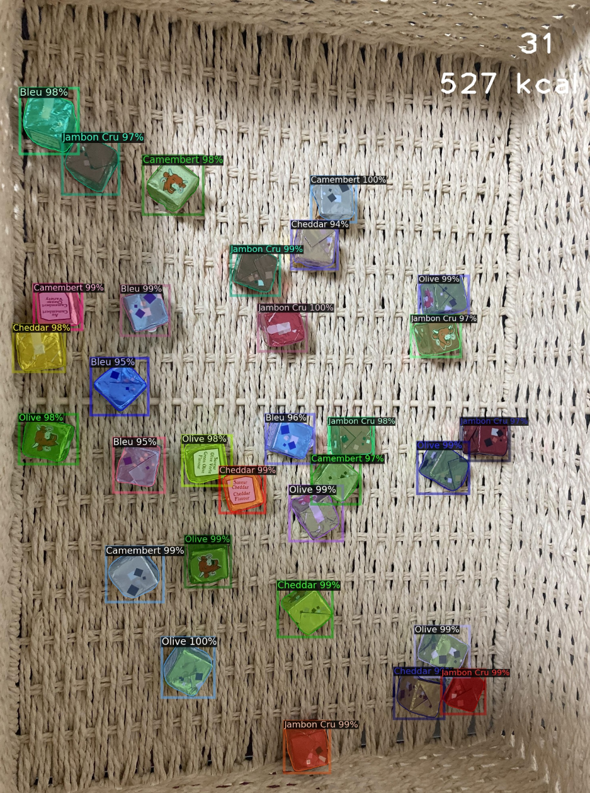

# Cheese-Cubes-Instance-Segmentation
Small project on custom small dataset. 
We use instance segmentation (detectron2) to detect and classify flavors of French delicious cheese cubes. 

Disclaimer. This is a tiny project made in my free time when I was trying to learn instance segmentation. It's fairly simple and can probably be improved !

## Environment
```
conda env create -f environment.yml
```

## Dataset
A very small toy dataset was created by annotating 39 photos of cheese cubes of 5 different flavors :
- Olive
- Jambon Cru (Cured Ham)
- Bleu (Blue cheese)
- Camembert
- Cheddar

The data was annotated using [labelme](https://github.com/wkentaro/labelme).

Please contact me if you want to download the dataset !

Example of image :


## Convert the labels 

The labels need to be converted to COCO format before training. Please run :
```
python3 utils/labelme2coco.py "data/train" "data/train_coco" data/labels.txt
```

## Training
Please set data paths, output folder path inside the file and run :
```
python3 train.py
```

Note. Training can be quite long even with small dataset. Metrics can be stuck at 0 / Nan for long time.
Please try changing parameters in train.py to save up time and accelerate convergence.

## Inference
Please run
```
python3 test.py -input_dir data/test_coco -annotation data/test_coco/annotations.json -model_weight output/best.pth -output_dir output/test
```

## Example of results


## Folder organization example
```
.
├── data 
│   ├── test 
│   │    ├── img1.jpg
│   │    ├── img1.json
│   │    ├── img2.jpg
│   │    ├── img2.json
│   │    └── ...
│   ├── train
│   ├── validation
│   └── labels.txt   
├── models
├── utils
├── environment.yml
├── LICENSE
├── README.md
├── test.py
└── train.py
```

## Other
Ressources used to make this repo include :

- [Official documentation of detectron 2](https://detectron2.readthedocs.io/en/latest/index.html) : used to make our customer Trainer, eval functions etc
- [Roboflow blog article](https://blog.roboflow.com/how-to-train-detectron2/) : used as example of how to register datasets and set config
