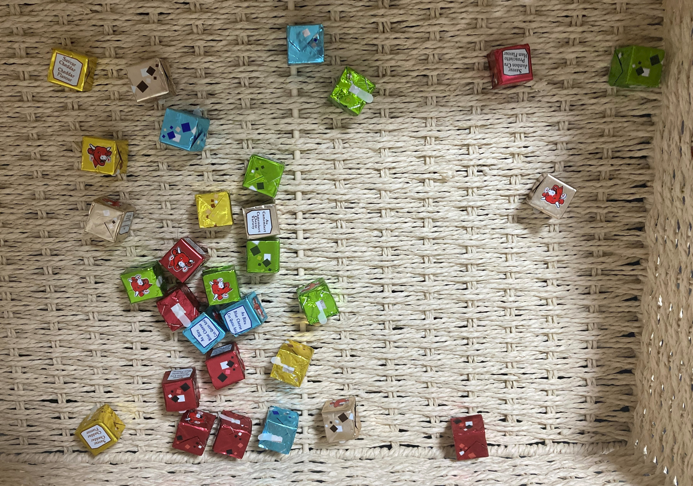

# Cheese-Cubes-Instance-Segmmentation
Small project on custom small dataset. 
We use instance segmentation (detectron2) to detect and classify flavors of French delicious cheese cubes. 

Disclaimer. This is a tiny project made in my free time when I was trying to learn instance segmentation. I'm in the process of cleaning, adding documentation to this repo. Please be patient with me !

## Dataset
A very small toy dataset was created by annotating 39 photos of cheese cubes of 5 different flavors :
- Olive
- Jambon Cru (Cured Ham)
- Bleu (Blue cheese)
- Camembert
- Cheddar

Please contact me if you want to download the dataset !

## Training

## Inference

## Example of results

## Folder organization
